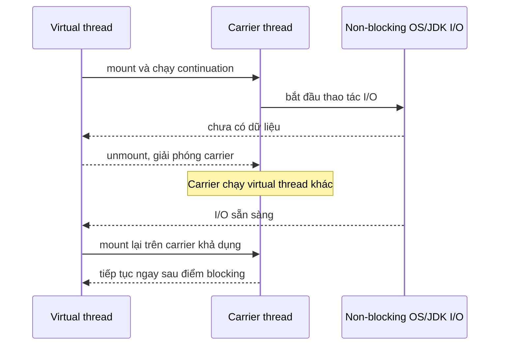
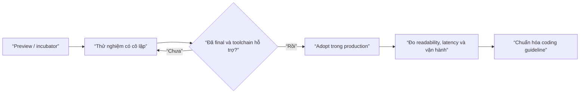

# Module 14 — Java Modern (8 → 21+)

> **Mức độ ưu tiên: Cao (Java 8 essentials) → Trung bình (9–17) → Bổ sung (21 LTS)** — Code Java hiện đại trông rất khác Java "cổ điển". Java 8 là bắt buộc khi phỏng vấn; ngày càng nhiều dự án chạy thẳng trên Java 17/21 LTS. Không cập nhật sẽ khiến code trông cũ và bỏ lỡ nhiều công cụ giúp code an toàn, ngắn hơn.

> **Phạm vi bài này:** các tính năng ngôn ngữ/thư viện lõi thêm từ Java 8 tới 21 — `Optional`, `record`, `var`, `sealed`, pattern matching (`instanceof`/`switch`/record), text block, virtual thread, và các API String/tiện ích nhỏ. **Chỉ nhắc lại — đã học ở module khác:** Stream/lambda (Module 10), Collections factory (Module 08), `java.nio.file` (Module 11), switch expression & `yield` (Module 02), helpful NPE (Module 11), `record` equals/hashCode (Module 07), cơ chế thread & `ExecutorService` (Module 12–13). Các chỗ chạm chỉ trỏ về nơi học sâu.

---

## Mục lục

1. [`Optional<T>` — chấm dứt NullPointerException](#1-optionalt--chấm-dứt-nullpointerexception)
2. [`record` — data carrier bất biến (Java 16+)](#2-record--data-carrier-bất-biến-java-16)
3. [`var` — Local Variable Type Inference (Java 10+)](#3-var--local-variable-type-inference-java-10)
4. [`sealed` — kế thừa có kiểm soát (Java 17+)](#4-sealed--kế-thừa-có-kiểm-soát-java-17)
5. [Pattern Matching cho `instanceof` (Java 16+)](#5-pattern-matching-cho-instanceof-java-16)
6. [Pattern Matching cho `switch` (Java 21+)](#6-pattern-matching-cho-switch-java-21)
7. [Record Pattern — destructuring (Java 21+)](#7-record-pattern--destructuring-java-21)
8. [Text Block (Java 15+)](#8-text-block-java-15)
9. [`java.time` — Date and Time API (Java 8)](#9-javatime--date-and-time-api-java-8)
10. [Virtual Threads (Java 21 LTS)](#10-virtual-threads-java-21-lts)
11. [String & API tiện ích mới (Java 9–17)](#11-string--api-tiện-ích-mới-java-9-17)
12. [Java Platform Module System — JPMS (Java 9)](#12-java-platform-module-system--jpms-java-9)
13. [Sequenced Collections (Java 21)](#13-sequenced-collections-java-21)
14. [Tổng kết — Bảng ghi nhớ nhanh](#14-tổng-kết--bảng-ghi-nhớ-nhanh)
15. [Bài tập luyện tập](#15-bài-tập-luyện-tập)

---

## 1. `Optional<T>` — chấm dứt NullPointerException

Tony Hoare gọi việc phát minh `null` là *"sai lầm trị giá hàng tỷ đô"*. `Optional<T>` (Java 8) là "hộp" **có hoặc không có giá trị**, buộc caller xử lý tường minh trường hợp rỗng thay vì để `null` lan truyền rồi crash xa nguồn.

### Từ `null` sang `Optional`

```java
public Optional<User> findUserById(Long id) {
    User user = repository.rawFind(id);      // có thể null
    return Optional.ofNullable(user);         // null → Optional.empty()
}
```

### Cách tiêu thụ

```java
Optional<User> r = findUserById(999L);

r.ifPresent(u -> render(u));                              // có thì làm
r.ifPresentOrElse(this::render, this::render404);         // Java 9 — có / không, hai nhánh
User u1 = r.orElse(GUEST);                                // giá trị mặc định (LUÔN dựng, kể cả khi không cần)
User u2 = r.orElseGet(this::loadGuest);                   // lazy — chỉ dựng khi thực sự rỗng
User u3 = r.orElseThrow();                                // Java 10 — ném NoSuchElementException
User u4 = r.orElseThrow(() -> new ResourceNotFoundException("User", 999L));   // Module 11
Optional<User> u5 = r.or(() -> findInCache(999L));        // Java 9 — Optional thay thế nếu rỗng
```

### Chaining — `map` / `filter` / `flatMap`

```java
String email = findUserById(1L)
    .map(User::getEmail)                       // Optional<String>
    .filter(e -> e.contains("@"))              // không thỏa → empty
    .map(String::toLowerCase)
    .orElse("không có email");

Optional<Address> addr = findUserById(1L)
    .flatMap(User::findPrimaryAddress);        // getPrimaryAddress trả Optional<Address> → flatMap để KHÔNG lồng
```

### `Optional.stream()` — lọc-và-mở-hộp gọn (Java 9)

```java
List<Email> emails = userIds.stream()
    .map(this::findUserById)          // Stream<Optional<User>>
    .flatMap(Optional::stream)        // bỏ empty, mở hộp phần còn lại
    .map(User::getEmail)
    .toList();
```

### Bản nguyên thủy — tránh boxing

```java
OptionalInt max = IntStream.of(3, 1, 4).max();   // OptionalInt, không phải Optional<Integer>
double avg = scores.stream().mapToDouble(s -> s).average().orElse(0.0);
```

### ⚠️ Anti-pattern

| Sai | Đúng |
|---|---|
| `opt.get()` khi chưa chắc có | `opt.orElseThrow(...)` / `orElse(...)` |
| `if (opt.isPresent()) return opt.get(); else return x;` | `opt.orElse(x)` |
| `Optional.of(map.get(k))` | `Optional.ofNullable(map.get(k))` (`of` ném NPE nếu null) |
| `Optional<String> field;` trong Entity/DTO | Field kiểu `String` (nullable). `Optional` **không `Serializable`**, gây rối JPA/Jackson |
| Tham số method `void m(Optional<X> x)` | Nạp chồng, hoặc nhận `X` nullable + `@Nullable` |
| `Optional<List<T>>` | Trả `List` **rỗng** |

> **Quy tắc vàng:** `Optional` chỉ để làm **kiểu trả về** của method "có thể không tìm thấy" (`findById`, `findFirst`...). Không field, không tham số, không collection. Và nó **cấp phát object** — không dùng trong vòng lặp cực nóng.

---

## 2. `record` — data carrier bất biến (Java 16+)

```java
public record Point(int x, int y) { }
// Tự sinh: constructor chuẩn tắc, accessor x()/y() (KHÔNG phải getX()), equals()/hashCode()/toString() trên MỌI component
```

```java
Point p = new Point(3, 4);
p.x();                              // 3
p;                                 // Point[x=3, y=4]
p.equals(new Point(3, 4));          // true
```

### Ba loại constructor

```java
public record Range(int lo, int hi) {

    // (a) COMPACT — không có (), chỉ validate/chuẩn hóa THAM SỐ; KHÔNG viết this.lo = lo
    public Range {
        if (lo > hi) throw new IllegalArgumentException("lo > hi");
        lo = Math.max(lo, 0);          // gán lại THAM SỐ → this.lo nhận giá trị đã chuẩn hóa
    }

    // (b) NON-CANONICAL — PHẢI ủy quyền về canonical bằng this(...)
    public Range(int hi) { this(0, hi); }

    // (c) CANONICAL TƯỜNG MINH — thay cho compact; phải tự gán TẤT CẢ field (hiếm dùng)
    // public Range(int lo, int hi) { this.lo = lo; this.hi = hi; }
}
```

### Có method, static, implements interface, generic, local

```java
public record Money<C extends Currency>(long cents, C currency) implements Comparable<Money<C>> {
    public static <C extends Currency> Money<C> zero(C c) { return new Money<>(0, c); }
    public Money<C> plus(Money<C> other) { return new Money<>(cents + other.cents, currency); }
    @Override public int compareTo(Money<C> o) { return Long.compare(cents, o.cents); }
}

void report(List<Order> orders) {
    record Row(String sku, long total) { }        // LOCAL record (Java 16) — gom dữ liệu tạm trong method
    orders.stream().map(o -> new Row(o.sku(), o.total())).forEach(System.out::println);
}
```

### Giới hạn & lưu ý

- **Luôn `final`**, **không `extends`** (nhưng `implements` thoải mái); nested record ngầm `static`.
- **Không thêm instance field** ngoài các component; **không có setter** — "sửa" = tạo record mới (`withX` viết tay).
- `Serializable` **an toàn**: deserialize đi qua constructor chuẩn tắc → validate được thực thi (khác class thường — Module 11).
- Component kiểu **mảng**: `equals()`/`hashCode()` sinh sẵn so sánh **tham chiếu** → dùng `List` thay `T[]`, hoặc override tay (Module 07).
- Reflection: `Class.isRecord()`, `Class.getRecordComponents()`.
- **Không dùng làm JPA Entity** — Entity cần constructor rỗng + mutable + proxy. `record` = **DTO / value object / khóa phức hợp / kiểu trả về nhiều giá trị**.
- `record` + `sealed` + pattern switch = "kiểu dữ liệu đại số" (algebraic data type) — mục 4, 7.

---

## 3. `var` — Local Variable Type Inference (Java 10+)

Compiler suy kiểu biến **local** từ vế phải. **Vẫn statically typed** — kiểu cố định từ compile-time, chỉ là không phải gõ ra.

```java
var name = "Pho";                        // String
var nums = new ArrayList<Integer>();      // ArrayList<Integer>
// name = 123;                            // ✗ vẫn là String
```

### Giới hạn cú pháp

```java
var x = 10;                    // ✓ chỉ local variable (thân method, for, try-with-resources)
// var f;                       // ✗ phải khởi tạo NGAY
// var n = null;                // ✗ không suy được kiểu
// var a = { 1, 2, 3 };         // ✗ array initializer trần
// var g = () -> 42;            // ✗ lambda cần "kiểu đích"
// var h = Foo::bar;            // ✗ method reference cần "kiểu đích"
// field / kiểu trả về / tham số method: KHÔNG dùng var
list.forEach((var s) -> ...);   // Java 11 — var trong tham số lambda CHỈ để gắn annotation: (@NonNull var s) ->
```

### Hai cái bẫy

```java
var a = new ArrayList<>();        // ⚠️ ArrayList<Object> — diamond không có gì để suy → Object
var b = new ArrayList<String>();  // ✓ ArrayList<String>

var list = new ArrayList<String>();   // kiểu là ArrayList<String>, KHÔNG phải List<String>
// Muốn lập trình theo interface → khai báo tường minh: List<String> list = new ArrayList<>();
```

### Kiểu "không viết ra được" (non-denotable)

```java
var o = new Object() { int hits = 0; };   // kiểu lớp ẩn danh — o.hits hợp lệ; không có cách viết kiểu này bằng tay
```

### Khi nào dùng

| Nên | Không nên |
|---|---|
| Vế phải đã nói rõ kiểu: `var m = new HashMap<String, List<Order>>();` | `var r = calculate();` — người đọc phải đi tra `calculate()` |
| Bỏ lặp generic dài | Chỗ làm giảm rõ ràng |
| Kiểu non-denotable (lớp ẩn danh) | Literal số dễ nhầm (`var i = 0` là `int`, `var l = 0` **không** phải `long`) |

> `var` là công cụ **giảm rườm rà, không giảm rõ ràng**. Lạm dụng ở chỗ kiểu mờ đi ngược mục đích của chính nó.

---

## 4. `sealed` — kế thừa có kiểm soát (Java 17+)

`sealed` giới hạn **tường minh** danh sách subtype được phép kế thừa. Dùng được cho cả **interface** lẫn **abstract class**.

```java
public sealed interface Shape permits Circle, Rectangle, Triangle {
    double area();
}
public record Circle(double r) implements Shape { public double area() { return Math.PI * r * r; } }
public record Rectangle(double w, double h) implements Shape { public double area() { return w * h; } }
public non-sealed class Triangle implements Shape {   // MỞ LẠI — cho kế thừa tự do
    private final double base, height;
    public Triangle(double base, double height) { this.base = base; this.height = height; }
    public double area() { return 0.5 * base * height; }
}
```

Mỗi subtype **bắt buộc** là một trong ba: `final` / `sealed` (giới hạn tiếp) / `non-sealed` (mở lại).

### Quy tắc `permits`

- **Bỏ được `permits`** nếu mọi subtype nằm **cùng file `.java`**.
- Subtype phải **cùng module** (hoặc cùng package nếu module không tên) và **accessible**.
- Reflection: `Class.isSealed()`, `Class.getPermittedSubclasses()`.

### Lợi ích chính: switch **kiểm tra đủ trường hợp** (exhaustiveness)

```java
double area(Shape s) {
    return switch (s) {
        case Circle c    -> c.area();
        case Rectangle r -> r.area();
        case Triangle t  -> t.area();
        // KHÔNG cần default — compiler biết đây là TOÀN BỘ khả năng (nhờ permits)
    };
}
```

Thêm `Hexagon` vào `permits` mà **quên** cập nhật `switch` này ⇒ **lỗi compile ngay** (`the switch expression does not cover all possible input values`). Đây chính là **tính năng**: mọi chỗ xử lý `Shape` được compiler "điểm danh" lại.

> **So với `enum`:** `enum` cố định tập **giá trị (instance)**; `sealed` cố định tập **kiểu**, mỗi kiểu mang state và hành vi riêng.

---

## 5. Pattern Matching cho `instanceof` (Java 16+)

```java
// CŨ
if (obj instanceof String) {
    String s = (String) obj;          // cast thủ công dư thừa
    use(s.length());
}
// MỚI
if (obj instanceof String s) {         // s: biến mới, kiểu String, dùng ngay
    use(s.length());
}
```

### Kết hợp điều kiện + "flow scoping"

```java
if (obj instanceof String s && s.length() > 3) { ... }   // ✓ && đảm bảo s đã gán trước khi dùng

if (!(obj instanceof String s)) {
    return;                            // ở nhánh này s CHƯA gán
}
use(s.length());                       // ✓ ra khỏi if, s CHẮC CHẮN đã gán — phạm vi biến theo LUỒNG, không theo khối

// if (obj instanceof String s || s.isEmpty()) { }   // ✗ nhánh || không đảm bảo s đã gán
```

`null instanceof X` luôn `false` → biến pattern **không bao giờ** nhận `null`.

---

## 6. Pattern Matching cho `switch` (Java 21+)

`switch` theo **kiểu**, có guard `when`, có `case null`.

```java
String describe(Object obj) {
    return switch (obj) {
        case null                       -> "null";                 // Java 21 — case null hợp lệ
        case Integer i when i > 0        -> "dương: " + i;           // guard
        case Integer i                  -> "không dương: " + i;
        case String s when s.isBlank()   -> "chuỗi rỗng";
        case String s                   -> "chuỗi: " + s;
        default                          -> "kiểu khác: " + obj.getClass().getSimpleName();
    };
}
```

### Bốn điều cần nhớ

1. **Không có `case null` mà `switch` gặp `null`** → vẫn ném `NullPointerException` (giữ tương thích ngược). Có thể gộp: `case null, default -> ...`.
2. **Dominance** — case tổng quát đặt **trước** case hẹp hơn ⇒ **lỗi compile**:
   ```java
   case CharSequence cs -> ...;
   case String s        -> ...;   // ✗ "this case label is dominated by a preceding case label"
   ```
3. **Exhaustiveness** — `switch` theo `sealed`/`enum` phải phủ hết hoặc có `default`.
4. **`MatchException` (Java 21)** — ném lúc runtime khi: switch "đủ" theo compile nhưng hierarchy `sealed` đã đổi ở nơi biên dịch riêng và không case nào khớp; hoặc accessor của record ném exception trong deconstruction pattern.

Mũi tên `case X x -> ...` **không** fall-through; kiểu hai chấm `case X x: ... yield v;` vẫn fall-through như cũ (Module 02). Trộn hai kiểu trong một `switch` là lỗi compile.

---

## 7. Record Pattern — destructuring (Java 21+)

Tách thẳng component của `record` tại điểm khớp kiểu.

```java
public record Point(int x, int y) {}

if (obj instanceof Point p) { use(p.x(), p.y()); }              // pattern kiểu
if (obj instanceof Point(int x, int y)) { use(x, y); }           // RECORD pattern — tách luôn
```

### Lồng nhau + `var` + `sealed` = xử lý cây dữ liệu

```java
sealed interface Json permits JNull, JStr, JArr {}
record JNull() implements Json {}
record JStr(String v) implements Json {}
record JArr(List<Json> items) implements Json {}

String render(Json j) {
    return switch (j) {
        case JNull()          -> "null";
        case JStr(String v)   -> "\"" + v + "\"";
        case JArr(var items)  -> items.stream().map(this::render).collect(joining(",", "[", "]"));
        // đủ nhánh cho sealed → không cần default
    };
}

record Line(Point start, Point end) {}
String desc(Object o) {
    return switch (o) {
        case Line(Point(var x1, var y1), Point(var x2, var y2)) -> "(%d,%d)→(%d,%d)".formatted(x1, y1, x2, y2);
        case Point(var x, var y)                                 -> "(%d,%d)".formatted(x, y);
        default                                                  -> "?";
    };
}
```

`var` trong record pattern suy kiểu từ component. Với record generic: `case Box(var content) -> ...` suy `content` theo tham số kiểu.

---

## 8. Text Block (Java 15+)

```java
// CŨ — khó đọc
String json = "{\n  \"name\": \"Pho\",\n  \"age\": 22\n}";

// MỚI
String json2 = """
    {
      "name": "Pho",
      "age": 22
    }
    """;
```

### Quy tắc khoảng trắng

- `"""` mở **phải xuống dòng ngay** (`"""x` là lỗi compile).
- Java xóa phần thụt lề **chung** của mọi dòng ("incidental whitespace"), tính **cả dòng `"""` đóng** — đặt `"""` đóng lùi vào bao nhiêu thì giữ lại bấy nhiêu thụt lề.
- **Khoảng trắng cuối mỗi dòng bị xóa** tự động — muốn giữ, kết dòng bằng `\s`.
- `\` ở cuối dòng = **nối dòng**, không chèn `\n`.
- Vẫn là **hằng số compile-time** `String` (được intern như literal thường).

```java
String sql = """
    SELECT u.id, u.name
    FROM users u
    WHERE u.status = 'ACTIVE'
    ORDER BY u.created_at DESC
    """;

String greeting = """
    Xin chào %s,
    Đơn %d của bạn đã được xác nhận.
    """.formatted(name, orderId);
```

> Hữu ích cho native query JPA (Module 20), JSON test fixture (Module 26), HTML/email template. **Không** dùng cho dữ liệu thay đổi hoặc chuỗi i18n (dùng resource bundle).

---

## 9. `java.time` — Date and Time API (Java 8)

Trước Java 8, xử lý ngày giờ trong Java dựa trên `java.util.Date` và `java.util.Calendar` — cả hai đều **mutable** (gây bug khi chia sẻ giữa nhiều nơi), **không thread-safe** (`SimpleDateFormat` là ví dụ kinh điển — Module 05.2), API lộn xộn (tháng đếm từ `0`, năm tính từ `1900`), và trộn lẫn khái niệm "thời điểm" với "ngày theo lịch". Java 8 thay bằng bộ API mới trong `java.time` (dựa trên thư viện Joda-Time), theo đúng tinh thần **bất biến** như `String`/`record` — mọi thao tác "sửa" đều trả về **object mới**.

### Các lớp cốt lõi — phân biệt theo "có gắn múi giờ hay không"

| Lớp | Đại diện cho | Ví dụ |
|---|---|---|
| `LocalDate` | Ngày theo lịch, **không giờ, không múi giờ** | `2026-09-19` |
| `LocalTime` | Giờ trong ngày, không ngày, không múi giờ | `14:30:00` |
| `LocalDateTime` | Ngày + giờ, **vẫn không múi giờ** | `2026-09-19T14:30:00` |
| `ZonedDateTime` | Ngày + giờ + **múi giờ cụ thể** | `2026-09-19T14:30:00+07:00[Asia/Ho_Chi_Minh]` |
| `Instant` | Một **thời điểm tuyệt đối** trên dòng thời gian (số giây/nano kể từ epoch UTC) | `2026-09-19T07:30:00Z` |
| `Duration` | Khoảng cách thời gian tính bằng **giây/nano** (giữa hai `Instant`/`LocalTime`) | `PT2H30M` (2 giờ 30 phút) |
| `Period` | Khoảng cách thời gian tính bằng **năm/tháng/ngày theo lịch** (giữa hai `LocalDate`) | `P1Y2M3D` (1 năm 2 tháng 3 ngày) |

```java
LocalDate today = LocalDate.now();                     // ngày hiện tại theo múi giờ hệ thống
LocalDate birthday = LocalDate.of(2003, Month.MARCH, 15);  // tháng là ENUM, không phải số 0-11 như Calendar cũ
LocalDateTime meeting = LocalDateTime.of(2026, 9, 20, 14, 30);
ZonedDateTime zoned = ZonedDateTime.now(ZoneId.of("Asia/Ho_Chi_Minh"));
Instant now = Instant.now();                            // mốc tuyệt đối, dùng cho timestamp lưu DB/log
```

> **Quy tắc chọn lớp:** lưu **timestamp sự kiện** (log, `createdAt` trong DB) → `Instant`. Biểu diễn **ngày sinh nhật/hạn hợp đồng** (không phụ thuộc giờ/múi giờ) → `LocalDate`. Hiển thị cho người dùng theo múi giờ cụ thể → `ZonedDateTime`. Hầu hết trường hợp backend (không cần hiển thị múi giờ) → `LocalDateTime` là đủ.

### Bất biến — mọi phép "cộng/trừ" trả về object mới

```java
LocalDate d1 = LocalDate.of(2026, 1, 31);
LocalDate d2 = d1.plusMonths(1);     // 2026-02-28 (tự động xử lý tháng ngắn hơn — không có "31/2")
d1.equals(LocalDate.of(2026, 1, 31));  // true — d1 KHÔNG bị đổi bởi plusMonths()

LocalDate d3 = d1.plusDays(10).minusYears(1).withDayOfMonth(1);   // chuỗi (chaining) như StringBuilder nhưng luôn tạo object mới
```

> ⚠️ **Bẫy kinh điển:** `date.plusDays(5);` (không gán lại kết quả) — giống hệt bẫy `String` bất biến (Module 01.1) — dòng này **không có tác dụng gì**, vì `plusDays` trả về object mới thay vì sửa `date`.

### So sánh, tính khoảng cách

```java
d1.isBefore(d2);  d1.isAfter(d2);  d1.isEqual(d2);
long daysBetween = ChronoUnit.DAYS.between(d1, d2);
Period p = Period.between(d1, d2);          // ví dụ: "2 năm 3 tháng 10 ngày"
Duration dur = Duration.between(instant1, instant2);   // ví dụ: "PT36H" (36 giờ) — chính xác tới nano
```

### Định dạng & phân tích chuỗi — `DateTimeFormatter` (thread-safe, thay `SimpleDateFormat`)

```java
DateTimeFormatter fmt = DateTimeFormatter.ofPattern("dd/MM/yyyy HH:mm");
String s = LocalDateTime.now().format(fmt);          // "19/09/2026 14:30"
LocalDateTime parsed = LocalDateTime.parse("19/09/2026 14:30", fmt);   // ngược lại — parse

// Chuẩn ISO-8601 (mặc định toString(), không cần formatter):
LocalDate.now().toString();     // "2026-09-19"
```

`DateTimeFormatter` là **immutable & thread-safe** — khai báo **một lần** dùng `static final`, chia sẻ an toàn giữa nhiều thread (khác hẳn `SimpleDateFormat` phải tạo mới mỗi lần hoặc bọc `ThreadLocal` — Module 05.2).

### Chuyển đổi qua lại với API cũ (khi tích hợp thư viện/JDBC cũ)

```java
Date legacyDate = Date.from(instant);                       // java.time → java.util
Instant back = legacyDate.toInstant();                       // java.util → java.time
LocalDateTime ldt = LocalDateTime.ofInstant(instant, ZoneId.systemDefault());
```

### Liên hệ Spring/JPA

`LocalDate`/`LocalDateTime`/`Instant` được Hibernate/JPA hỗ trợ ánh xạ trực tiếp (Module 20) sang `DATE`/`TIMESTAMP` của SQL mà không cần converter thủ công (khác `java.util.Date` cần cấu hình `@Temporal` rườm rà hơn); Jackson tự serialize/deserialize sang ISO-8601 JSON khi có `jackson-datatype-jsr310` (mặc định đã kèm trong Spring Boot).

---

## 10. Virtual Threads (Java 21 LTS)

Thay đổi lớn nhất của Java nhiều năm (Project Loom). Liên hệ Module 05.

### Vấn đề của Platform Thread

Mỗi `Thread` truyền thống = **một OS thread** (~1 MB stack, đăng ký scheduler) → trần thực tế vài nghìn thread, trong khi backend I/O-bound cần phục vụ **hàng trăm nghìn** kết nối đồng thời (phần lớn thời gian chỉ *chờ* DB/API).

### Virtual thread — siêu nhẹ

```java
Thread.ofVirtual().start(() -> handle(request));   // cú pháp gần như Platform Thread

try (var pool = Executors.newVirtualThreadPerTaskExecutor()) {
    for (int i = 0; i < 100_000; i++)
        pool.submit(() -> { Thread.sleep(1000); return null; });   // hàng trăm nghìn task I/O — không cạn tài nguyên
}
```

### Cơ chế M:N — mount/unmount

```
Hàng trăm nghìn virtual thread
        │
        ▼   khi virtual thread BLOCK (I/O, sleep, java.util.concurrent lock):
  JVM unmount nó khỏi carrier thread → carrier chạy virtual thread khác
        ▼
  Vài carrier thread (ForkJoinPool, số lượng = số nhân CPU)
```



Virtual thread làm code blocking theo kiểu tuần tự có khả năng scale vì thời gian chờ I/O không giữ platform thread. Nó không làm CPU-bound code nhanh hơn: lúc thực thi Java, virtual thread vẫn cần carrier/CPU. Pinning (mục dưới) xảy ra khi continuation không thể unmount ở một số critical section; khi đó carrier bị giữ trong lúc chờ. Mental model đúng là "thread rẻ để chờ", không phải "tạo vô hạn công việc": database connection, remote quota và memory vẫn cần semaphore/pool/backpressure.

Blocking mà virtual thread **unmount** được (tốt): `Thread.sleep`, I/O của `java.nio`/socket, `java.util.concurrent` lock, `BlockingQueue`.

### ⚠️ Pinning — khi virtual thread KHÔNG unmount được

Trên Java 21, virtual thread bị **ghim (pinned)** vào carrier thread — mất lợi ích chính — khi:
- Đang trong khối **`synchronized`** và gặp thao tác blocking.
- Gọi **native method** (JNI).

Xử lý: tạm thay `synchronized` bằng `ReentrantLock` (Module 13) ở đường đi nóng. Debug bằng `-Djdk.tracePinnedThreads=full`. (JDK mới hơn — JEP 491 — đã loại bỏ pinning do `synchronized`.)

### Quy tắc dùng

| Nên | Không nên / lưu ý |
|---|---|
| **I/O-bound**, độ đồng thời cực cao (web server, gọi nhiều microservice) | **CPU-bound** — không lợi ích, vẫn bị giới hạn bởi số nhân |
| Tạo **mới cho mỗi task** (`newVirtualThreadPerTaskExecutor`) | **Đừng pool** virtual thread — chúng vốn rẻ; pool làm mất mục đích |
| Giới hạn tài nguyên (kết nối DB) bằng `Semaphore` | Đừng giới hạn bằng "kích thước pool" như Platform Thread |
| — | Virtual thread **luôn là daemon**, không đặt priority; `ThreadLocal` vẫn chạy nhưng cân nhắc `ScopedValue` (preview) khi có hàng triệu vthread |

> Structured concurrency (`StructuredTaskScope`, preview) — nhóm nhiều virtual thread con vào một phạm vi, hủy/chờ như một khối. Ngoài phạm vi bài.

> **Spring Boot 3.2+ / Java 21+:** `spring.threads.virtual.enabled=true` → mỗi request HTTP chạy trên một virtual thread thay vì tranh pool Platform Thread giới hạn — tăng throughput rõ rệt cho backend CRUD/API (vốn I/O-bound: chủ yếu chờ database).

---

## 11. String & API tiện ích mới (Java 9–17)

Những cải tiến nhỏ nhưng gặp hằng ngày:

```java
"  xin chào  ".strip();          // Java 11 — trim nhận biết Unicode (khác trim() cũ chỉ xử lý ≤ U+0020)
"   ".isBlank();                  // Java 11 — true nếu rỗng hoặc chỉ whitespace
"ab".repeat(3);                  // Java 11 — "ababab"
"a\nb\nc".lines().count();       // Java 11 — Stream<String>, 3
"name=%s".formatted("Pho");      // Java 15 — String.format kiểu instance
"""
  indented
""".stripIndent();               // Java 15 — thuật toán thụt lề của text block, gọi thủ công
```

Đã học ở module khác, nhắc để gom "bức tranh Java hiện đại":

| Nhóm | Ở đâu |
|---|---|
| `List.of` / `Map.of` / `Set.of` / `List.copyOf` (bất biến, null-hostile) | Module 08 |
| `Stream.toList()`, `mapMulti`, `takeWhile`/`dropWhile`, `Collectors.teeing` | Module 10 |
| `Optional.stream`/`or`/`ifPresentOrElse` | mục 1 |
| `Path.of`, `Files.readString`/`writeString`/`lines` | Module 11 |
| switch expression, `yield`, arrow-case | Module 02 |
| Helpful `NullPointerException` (Java 14) | Module 11 |
| `HttpClient` (Java 11 — client HTTP/2 async trong JDK) | Module 28 |

---

## 12. Java Platform Module System — JPMS (Java 9)

Trước Java 9, đơn vị đóng gói lớn nhất chỉ là **package** — mọi `public class` trong mọi JAR trên classpath đều nhìn thấy nhau, không có khái niệm "che" một package khỏi bên ngoài JAR. JPMS (còn gọi Project Jigsaw) thêm một tầng đóng gói **lớn hơn package**: **module**.

### `module-info.java` — khai báo module

```java
// nằm ở thư mục gốc của source set, ngang hàng package gốc
module com.pho.orderservice {
    requires java.sql;                 // module này CẦN module java.sql để compile/chạy
    requires transitive com.pho.core;  // ai requires orderservice thì cũng tự động thấy com.pho.core

    exports com.pho.orderservice.api;      // package này PUBLIC cho module khác
    exports com.pho.orderservice.dto to com.pho.orderservice.web;  // chỉ export CHO một module cụ thể (qualified export)

    // com.pho.orderservice.internal — KHÔNG exports → dù class là public,
    // module khác vẫn KHÔNG compile/reflect được vào nó (strong encapsulation thật sự)

    opens com.pho.orderservice.entity to org.hibernate.orm.core;  // cho phép reflection sâu (Hibernate/Jackson cần)
    uses com.pho.orderservice.spi.PaymentProvider;      // module này TIÊU THỤ một service (ServiceLoader)
    provides com.pho.orderservice.spi.PaymentProvider with com.pho.orderservice.impl.VnPayProvider; // và CUNG CẤP implementation
}
```

### Vì sao JPMS ra đời — hai vấn đề nó giải quyết

| Vấn đề trước Java 9 | JPMS giải quyết thế nào |
|---|---|
| **"JAR Hell"/Classpath Hell**: hai JAR khác version cùng tên gói trên classpath → JVM chọn một cách không kiểm soát được, lỗi `NoSuchMethodError` khó hiểu lúc runtime | Module có tên duy nhất, khai báo `requires` tường minh — xung đột bị phát hiện sớm hơn (dù chưa giải quyết được đa version hoàn toàn) |
| **`public` = mở toang cho cả thế giới**: muốn giấu class nội bộ chỉ có thể trông cậy vào convention (package `internal`) chứ compiler không chặn | `exports` là ranh giới **compiler enforce được** — package không export thì dù `public` vẫn không ai bên ngoài module gọi/compile vào được |
| JDK tự nó là một khối `rt.jar` khổng lồ, ứng dụng nhỏ vẫn phải mang theo toàn bộ runtime | JDK chia thành hàng chục module (`java.base`, `java.sql`, `java.xml`...) → `jlink` tạo runtime image **tối giản**, chỉ chứa module thực sự dùng |

### Vì sao module này KHÔNG đi sâu

Phần lớn ứng dụng Spring Boot/thư viện thực tế **vẫn chạy trên classpath truyền thống** (không có `module-info.java`) — hệ sinh thái Spring/Hibernate dựa nhiều vào reflection xuyên package mà JPMS mặc định chặn (`opens`), nên việc modular hóa toàn bộ một ứng dụng Spring là hiếm và tốn công. JPMS phổ biến nhất ở: (1) chính JDK, (2) thư viện lõi ổn định muốn bảo vệ API nội bộ nghiêm ngặt, (3) `jlink` để đóng gói runtime tối giản cho ứng dụng CLI/desktop.

> ⚠️ **Automatic module & unnamed module:** một JAR thường (không có `module-info.class`) khi được module khác `requires` sẽ tự động trở thành "automatic module" (tên suy từ tên file JAR, export mọi package) — cơ chế cầu nối để hệ sinh thái cũ dần tương thích ngược mà không phải sửa lại toàn bộ JAR cùng lúc.

### `jlink` và `jpackage` — từ module graph tới runtime tối thiểu

`jlink` ghép các JDK module cần thiết thành custom runtime, giảm image và loại module không dùng. `jdeps` hỗ trợ tìm dependency; `jpackage` đóng gói application + runtime thành native package phù hợp hệ điều hành.

```bash
jdeps --print-module-deps app.jar
jlink --add-modules java.base,java.logging,java.sql \
      --strip-debug --no-header-files --no-man-pages --output runtime
jpackage --name billing --input target --main-jar billing.jar --runtime-image runtime
```

> ⚠️ Reflection/service loading có thể làm static analysis bỏ sót module. Phải smoke-test image cuối, đặc biệt với framework. Custom runtime cũng phải được rebuild khi cập nhật bản vá JDK; nhỏ hơn không có nghĩa là tự động an toàn hơn.

---

## 13. Sequenced Collections (Java 21)

Trước Java 21, các collection có "thứ tự" (`List`, `LinkedHashSet`, `LinkedHashMap`) mỗi loại có API lấy phần tử đầu/cuối **khác nhau** (`list.get(0)` vs `list.get(list.size()-1)`, không có gì tương tự cho `LinkedHashSet`) — không có một interface chung diễn đạt khái niệm "có thứ tự, có đầu có cuối".

### Interface mới: `SequencedCollection`, `SequencedSet`, `SequencedMap`

```java
public interface SequencedCollection<E> extends Collection<E> {
    SequencedCollection<E> reversed();      // view đảo ngược thứ tự — KHÔNG copy dữ liệu
    void addFirst(E e);
    void addLast(E e);
    E getFirst();
    E getLast();
    E removeFirst();
    E removeLast();
}
```

`List`, `Deque`, `LinkedHashSet` giờ đều implement `SequencedCollection`. `LinkedHashMap`/`SortedMap` implement `SequencedMap` (thêm `firstEntry()`, `lastEntry()`, `sequencedKeySet()`...).

```java
List<Integer> nums = new ArrayList<>(List.of(1, 2, 3));
nums.getFirst();          // 1 — trước đây phải nums.get(0)
nums.getLast();           // 3 — trước đây phải nums.get(nums.size() - 1)
nums.addFirst(0);         // [0, 1, 2, 3]
List<Integer> rev = nums.reversed();   // view [3, 2, 1, 0] — sửa "nums" phản ánh ngay trên "rev" và ngược lại

LinkedHashSet<String> tags = new LinkedHashSet<>(List.of("a", "b", "c"));
tags.getFirst();          // "a" — LinkedHashSet trước đây KHÔNG có cách lấy phần tử đầu O(1) nào tường minh

LinkedHashMap<String, Integer> scores = new LinkedHashMap<>();
scores.put("An", 9); scores.put("Binh", 7);
scores.firstEntry();       // Map.Entry["An"=9]
scores.sequencedKeySet().reversed();   // duyệt key theo thứ tự chèn ngược
```

> **Lưu ý:** `reversed()` trả về **view** sống động (giống `Collections.unmodifiableList` là view, không phải bản sao) — thao tác ghi qua view phản ánh ngược lại collection gốc. `HashMap`/`HashSet` **không** implement các interface này vì bản chất chúng vốn không có thứ tự xác định.

---

### Quản trị Preview Feature & mô hình áp dụng tính năng Java mới

Preview feature cần `--enable-preview` lúc compile **và** runtime, gắn với đúng release, và có thể thay đổi hoặc bị rút ở bản sau. Dùng để thử nghiệm/feedback thì hợp lý; public library và hệ thống nâng JDK chậm nên cô lập preview sau boundary để giảm blast radius khi API đổi.



Tính năng mới chỉ có giá trị khi cả compiler, runtime, build plugin, IDE, framework và đội vận hành hỗ trợ; “JDK có syntax” chưa phải điều kiện đủ — đây cũng là lý do các mục trên đều ghi rõ tính năng ổn định từ bản Java nào trước khi khuyến nghị dùng trong production.

---

## 14. Tổng kết — Bảng ghi nhớ nhanh

| Tính năng | Java | Điểm mấu chốt |
|---|---|---|
| `Optional<T>` | 8 (9/10 bổ sung) | Chỉ làm **kiểu trả về**. `orElseGet` (lazy) > `orElse`. `map`/`flatMap`/`filter`/`stream`/`or`/`ifPresentOrElse`. Không field/tham số/collection; không `Serializable`; cấp phát object. |
| `record` | 16 | Tự sinh ctor/accessor/equals/hashCode/toString. `final`, không `extends`, không thêm field. Compact ctor chỉ chỉnh **tham số**; non-canonical phải `this(...)`. Component mảng → so tham chiếu. DTO/value object, **không** làm Entity. |
| `var` | 10 | Chỉ local, kiểu cố định. `new ArrayList<>()` → `ArrayList<Object>`. Suy ra **lớp cụ thể**, không interface. Không `null`/lambda/method-ref. Dùng khi kiểu đã rõ từ vế phải. |
| `sealed` | 17 | `permits` (bỏ được nếu cùng file); subtype `final`/`sealed`/`non-sealed`, cùng module. Bật exhaustiveness cho `switch` — thêm subtype làm vỡ compile mọi switch (tính năng). Interface hoặc abstract class. |
| Pattern `instanceof` | 16 | Tự cast + bind biến. Flow scoping: `if (!(o instanceof X x)) return;` rồi dùng `x`. `&&` được, `\|\|` không. |
| Pattern `switch` | 21 | Theo kiểu + `when` guard + `case null`. Dominance = lỗi compile. Exhaustiveness cho sealed/enum. `MatchException` runtime. Arrow không fall-through. |
| Record Pattern | 21 | `case Point(int x, int y)` tách component; lồng nhau; `var`; với `sealed` → không cần `default`. |
| Text Block | 15 | `"""` mở phải xuống dòng. Xóa thụt lề chung (theo `"""` đóng) + khoảng trắng cuối dòng. `\s` giữ space, `\` nối dòng. Là hằng số compile-time. `.formatted()`. |
| `java.time` | 8 | Thay `Date`/`Calendar` mutable, không thread-safe. `LocalDate`/`LocalDateTime` (không múi giờ), `ZonedDateTime` (có múi giờ), `Instant` (mốc tuyệt đối UTC). Bất biến — `plusDays()` không gán lại là no-op. `Duration` (giây/nano) vs `Period` (năm/tháng/ngày). `DateTimeFormatter` thread-safe thay `SimpleDateFormat`. |
| Virtual Thread | 21 LTS | Siêu nhẹ, M:N trên carrier (ForkJoinPool). Unmount khi I/O/`j.u.c` lock; **pin** khi `synchronized`+blocking hoặc JNI (Java 21). Đừng pool; giới hạn bằng `Semaphore`; luôn daemon. I/O-bound only. |
| String utils | 11/15 | `strip`, `isBlank`, `repeat`, `lines`, `formatted`, `stripIndent`. |
| JPMS (module) | 9 | `module-info.java`: `requires`/`exports`/`opens`/`uses`/`provides`. `exports` là ranh giới đóng gói compiler enforce được, mạnh hơn `public`. Hiếm dùng trực tiếp trong app Spring (do reflection), phổ biến ở JDK/`jlink`. |
| Sequenced Collections | 21 | `SequencedCollection`/`Set`/`Map` — `getFirst/getLast/addFirst/addLast/reversed()`. `reversed()` là **view** sống, không copy. `List`/`Deque`/`LinkedHashSet`/`LinkedHashMap` có; `HashMap`/`HashSet` thì không (vốn không có thứ tự). |

---

## 15. Bài tập luyện tập

### Phần A — Trắc nghiệm nhận định (giải thích lý do)

**Câu 1.** Đoạn này compile được nhưng sai thiết kế ở đâu? Sửa lại.
```java
public Optional<User> findUserById(Long id) {
    Optional<User> r = repository.findById(id);
    User user = r.get();
    return Optional.of(user);
}
```

**Câu 2.** `record Money(String currency, long cents)` — `money.cents = 100;` có hợp lệ không? Muốn "đổi" `cents` thì làm sao? Compact constructor viết `this.cents = Math.max(cents, 0);` có được không?

**Câu 3.** Đoạn nào compile, đoạn nào không? Vì sao?
```java
public sealed interface Animal permits Dog, Cat {}
public final class Dog implements Animal {}
public final class Cat implements Animal {}
public class Bird implements Animal {}          // (1)
```
```java
switch (animal) {                               // (2)
    case Dog d -> "gâu";
    case Cat c -> "meo";
}
```

**Câu 4.** Đoạn `switch` sau lỗi compile — vì sao? Sửa thế nào?
```java
String f(Object o) {
    return switch (o) {
        case CharSequence cs -> "chuỗi ký tự";
        case String s        -> "string";
        default              -> "khác";
    };
}
```

**Câu 5.** `var` suy ra kiểu gì cho mỗi dòng? Dòng nào không compile?
```java
var a = new ArrayList<>();
var b = List.of(1, 2, 3);
var c = null;
var d = new ArrayList<String>();
```

**Câu 6.** Sau `if (!(obj instanceof Point p)) return;`, biến `p` có dùng được ở dòng tiếp theo (ngoài `if`) không? Giải thích khái niệm liên quan.

**Câu 7.** Virtual thread gọi `Thread.sleep(5000)` thì chuyện gì xảy ra với carrier thread? Còn nếu `Thread.sleep(5000)` nằm **trong** một khối `synchronized` (trên Java 21)?

**Câu 8.** Text block sau cho chuỗi chính xác là gì (kể cả `\n` và khoảng trắng)?
```java
String s = """
        A
          B
        """;
```

---

### Phần B — Bài tập viết code

**Bài 1 — Refactor `null` → `Optional`.**
```java
public String getUserEmailDomain(Long userId) {
    User user = db.find(userId);
    if (user == null) return "unknown";
    String email = user.getEmail();
    if (email == null || !email.contains("@")) return "unknown";
    return email.substring(email.indexOf("@") + 1).toLowerCase();
}
```
Viết lại bằng chuỗi `Optional.ofNullable(...).map(...).filter(...).map(...).orElse(...)`. Viết thêm bản dùng `db.find` **đã trả `Optional<User>`** để thấy khi nào cần `flatMap`.

**Bài 2 — `sealed` + record + pattern switch: hệ thống `Result`.**
`sealed interface ApiResult<T> permits Success, Failure`; `record Success<T>(T data)`, `record Failure<T>(String message, int code)`. Viết `String render(ApiResult<String> r)` dùng **record pattern** trong `switch`, **không** `default` (chứng minh exhaustiveness). Thêm loại thứ ba `record Pending<T>()` vào `permits` và quan sát lỗi compile ở `render` — ghi lại thông báo.

**Bài 3 — Record pattern lồng nhau + guard.**
`record Address(String city, String country)`, `record Customer(String name, Address address)`. Viết `String label(Customer c)` bằng `switch` + record pattern lồng 2 tầng + `when`: nếu `country` là `"Vietnam"` → `"[name] ở [city]"`; ngược lại → `"[name] (quốc tế)"`.

**Bài 4 — Text block cho SQL + JSON.**
Method 1: trả câu SQL join 3 bảng (có `WHERE`, `GROUP BY`, `ORDER BY`) bằng text block. Method 2: trả JSON response mẫu (≥ 4 field, 1 field là mảng object lồng nhau), chèn giá trị động bằng `.formatted(...)`. Comment so sánh số ký tự escape với cách nối `+`.

**Bài 5 — `var` đúng và sai.**
Viết 6 khai báo: 3 chỗ `var` **cải thiện** khả năng đọc (generic dài, lớp ẩn danh, kết quả `new` rõ ràng) và 3 chỗ `var` **làm xấu** (kết quả method mờ nghĩa, literal số dễ nhầm `int`/`long`, cần lập trình theo interface). Comment giải thích từng chỗ.

**Bài 6 — Bài toán tổng hợp: 10_000 "request" bằng virtual thread.**
Mô phỏng 10_000 request đồng thời, mỗi request `Thread.sleep(100)` rồi trả kết quả, dùng `Executors.newVirtualThreadPerTaskExecutor()`. Đo tổng thời gian. So (bằng comment hoặc chạy) với `Executors.newFixedThreadPool(200)`: giải thích vì sao virtual thread ≈ 100 ms còn fixed(200) ≈ 10000/200 × 100 = 5000 ms, và điểm khác biệt về RAM/OS thread. Thêm `Semaphore(50)` để giới hạn số request **thực sự gọi "DB"** cùng lúc dù có 10_000 virtual thread — giải thích vì sao giới hạn bằng `Semaphore` chứ không bằng kích thước pool.

---

### Phần C — Nâng cao

**Câu 1.** `Optional` **không** implement `Serializable` và Javadoc khuyến nghị không dùng làm field. Nêu ba vấn đề cụ thể khi đặt `Optional<String> nickname` làm field của một JPA Entity hoặc một DTO serialize qua Jackson. Giải pháp thay thế cho từng ngữ cảnh (JPA / JSON API / trả về từ service).

**Câu 2.** Ba loại constructor của `record`. Vì sao compact constructor **không cho** viết `this.x = ...` mà chỉ được gán lại tham số? Điều gì xảy ra nếu một non-canonical constructor **không** gọi `this(...)`? Vì sao deserialize một `record` an toàn hơn deserialize một class thường có cùng field (liên hệ Module 11)?

**Câu 3.** `var a = new ArrayList<>()` cho `ArrayList<Object>` còn `var b = new ArrayList<String>()` cho `ArrayList<String>` (không phải `List<String>`). Giải thích cả hai. Với `var`, khi nào bạn **mất** khả năng "lập trình theo interface" và điều đó ảnh hưởng gì tới việc thay đổi implementation sau này?

**Câu 4.** `switch` pattern: giải thích **dominance** (vì sao là lỗi compile chứ không phải cảnh báo), **exhaustiveness** (khi nào bắt buộc `default`), và **`MatchException`** (hai nguyên nhân ném lúc runtime dù compile "đủ"). Cho một kịch bản separate compilation khiến switch "đủ" lúc build lại ném `MatchException` lúc chạy.

**Câu 5.** So sánh `sealed interface` + `record` + exhaustive `switch` với cách làm cũ (interface + các class implement + `visitor pattern` hoặc chuỗi `instanceof`). Nêu hai ưu điểm về bảo trì và một trường hợp visitor pattern vẫn tốt hơn.

**Câu 6.** Virtual thread "pinning": mô tả chính xác điều gì bị ghim vào điều gì, và vì sao `synchronized` + blocking gây ra nó trên Java 21 trong khi `ReentrantLock` + blocking thì không. Vì sao **không nên pool** virtual thread? Vì sao giới hạn truy cập tài nguyên nên dùng `Semaphore` thay vì giảm số thread? `-Djdk.tracePinnedThreads=full` cho biết gì?

**Câu 7.** Text block: phân biệt "incidental" và "essential" whitespace, và vai trò vị trí của `"""` đóng. Vì sao khoảng trắng cuối dòng bị xóa mặc định (và cách giữ lại)? Text block có phải hằng số compile-time không — điều đó ảnh hưởng gì tới String pool và so sánh `==`?

---

### Phần D — Gợi ý đáp án (tự chấm)

<details>
<summary>Bấm để xem gợi ý đáp án Phần A</summary>

1. `r.get()` khi `r` có thể rỗng → `NoSuchElementException` — "dùng Optional nhưng vẫn code như null". Ngoài ra `Optional.of(user)` sẽ NPE nếu `user` null. Sửa: `return repository.findById(id);` (trả thẳng), hoặc nếu cần biến đổi: `return repository.findById(id).map(this::enrich);`.
2. **Không** — component record là `private final`, chỉ có accessor `money.cents()`. "Đổi" = tạo mới: `new Money(money.currency(), 100)`. Compact constructor **không** cho `this.cents = ...` (chưa có field để gán ở thời điểm đó) — chỉ được `cents = Math.max(cents, 0);` (gán lại **tham số**, giá trị đó sẽ được Java tự gán vào `this.cents` sau khi compact ctor chạy xong).
3. (1) **Không compile** — `Bird implements Animal` nhưng không có trong `permits Dog, Cat`. (2) **Compile** — `Dog` và `Cat` là toàn bộ subtype được phép của sealed `Animal` → `switch` đủ nhánh, không cần `default`.
4. Lỗi **dominance**: `case String s` không bao giờ tới được vì mọi `String` đã khớp `case CharSequence cs` phía trên. Sửa: đảo thứ tự — `case String s` trước, `case CharSequence cs` sau.
5. `a` → `ArrayList<Object>` (diamond không suy được → Object). `b` → `List<Integer>` (`List.of` trả `List`). `c` → **không compile** (`null` không suy được kiểu). `d` → `ArrayList<String>`.
6. **Có.** `if (!(obj instanceof Point p)) return;` — nếu không khớp thì thoát; ra khỏi `if`, luồng chỉ tới được đây khi `obj` **là** `Point`, nên `p` chắc chắn đã gán → dùng được. Khái niệm: **flow scoping** — phạm vi biến pattern xác định theo phân tích luồng (definite assignment), không theo cặp ngoặc `{}`.
7. `Thread.sleep(5000)` bình thường: JVM **unmount** virtual thread khỏi carrier thread ngay → carrier phục vụ virtual thread khác; sau 5s vthread được mount lại vào một carrier rảnh bất kỳ. Trong khối `synchronized` (Java 21): vthread bị **pin** — không unmount được, carrier thread bị chiếm suốt 5s → mất lợi ích Loom cho khe thời gian đó. (Sửa: dùng `ReentrantLock`.)
8. `"A\n  B\n"` — dòng `"""` đóng lùi 8 space; phần thụt lề chung bị xóa là 8 space → `A` mất hết thụt lề, `B` (lùi 10 space) còn `2` space; mỗi dòng kết bằng `\n` (kể cả dòng cuối trước `"""`).

</details>

<details>
<summary>Bấm để xem gợi ý đáp án Phần B</summary>

- **Bài 1:** `return Optional.ofNullable(db.find(userId)).map(User::getEmail).filter(e -> e.contains("@")).map(e -> e.substring(e.indexOf("@") + 1).toLowerCase()).orElse("unknown");`. Bản `db.find` trả `Optional<User>`: giống hệt nhưng bỏ `ofNullable` — và nếu `User::getPrimaryEmail` cũng trả `Optional` thì phải `.flatMap(User::getPrimaryEmail)` thay vì `.map(...)`.
- **Bài 2:** `case Success<String>(String data) -> "OK: " + data; case Failure<String>(String msg, int code) -> "ERR " + code + ": " + msg;`. Thêm `Pending` → compiler báo `the switch expression does not cover all possible input values` tại `render` (và mọi switch khác trên `ApiResult`).
- **Bài 3:** `case Customer(var name, Address(var city, var country)) when country.equals("Vietnam") -> name + " ở " + city; case Customer(var name, var addr) -> name + " (quốc tế)";`.
- **Bài 4:** SQL/JSON bằng `"""..."""` — không còn `\"` và `\n`; `.formatted(id, name, items)` chèn động. Cách `+`: mỗi dòng một `"...\n" +`, mỗi dấu ngoặc kép bên trong phải `\"`.
- **Bài 5:** Nên: `var m = new EnumMap<Status, List<Order>>();`, `var listener = new Object(){ int n; };`, `var users = userRepo.findAll();` (kiểu rõ từ tên). Xấu: `var r = compute();` (mờ), `var timeout = 30;` (là `int`, dễ tưởng `long`), `var list = new ArrayList<String>();` khi API xung quanh nhận `List<String>` (giờ `list` là `ArrayList`, đổi sang `LinkedList` phải sửa khai báo).
- **Bài 6:** Virtual: `try (var ex = Executors.newVirtualThreadPerTaskExecutor()) { for (...) ex.submit(task); }` ≈ 100–300 ms (mọi task chờ song song). `newFixedThreadPool(200)` ≈ 5 s (10_000 / 200 lô × 100 ms). RAM: 10_000 vthread ~vài chục MB; 10_000 platform thread ~10 GB stack (không khả thi). `Semaphore(50)` bọc quanh lời gọi "DB": dù 10_000 vthread cùng chạy, chỉ 50 vào critical section — vì pool virtual thread **không có trần** để mà "giảm", nên điều tiết tải xuống tài nguyên hữu hạn (connection pool DB) phải bằng `Semaphore`.

</details>

<details>
<summary>Bấm để xem gợi ý đáp án Phần C</summary>

1. (i) `Optional` không `Serializable` → Entity/DTO chứa field `Optional` không serialize được qua RMI/session/cache Java. (ii) JPA provider không map được `Optional<String>` sang cột — cần `@Column` trên `String`; và không có constructor rỗng khởi tạo `Optional` đúng cách. (iii) Jackson mặc định serialize `Optional` thành `{"present":true,"value":...}` (xấu) trừ khi thêm `jackson-datatype-jdk8`; kể cả có module thì vòng đời null/absent gây nhập nhằng. Thay thế: JPA → field `String` nullable; JSON API → field nullable + `@JsonInclude(NON_NULL)`; service trả về → `Optional<X>` ở **chữ ký method** là hợp lệ và khuyến khích.
2. Compact constructor chạy **trước** khi các field `final` được gán — tại thời điểm đó `this.x` chưa tồn tại để gán; Java gán field tự động **sau** khi compact ctor kết thúc, dùng **giá trị hiện tại của tham số**, nên chỉ được "chuẩn hóa tham số". Non-canonical không gọi `this(...)` → lỗi compile (`constructor must invoke another constructor`); mọi đường khởi tạo phải hội tụ về canonical để đảm bảo validate/chuẩn hóa chạy đúng một lần. Deserialize record: đi qua canonical constructor → compact ctor (validate) được thực thi → không tạo được record vi phạm bất biến; class thường: `readObject` gán thẳng field, **bỏ qua** constructor (Module 11).
3. `new ArrayList<>()` — diamond cần "kiểu đích" để suy tham số kiểu; `var` không cung cấp kiểu đích → suy về `Object`. `new ArrayList<String>()` — tham số kiểu viết tường minh nên giữ `String`; nhưng `var` bắt **kiểu tĩnh của biểu thức khởi tạo** = `ArrayList<String>` (lớp cụ thể), không "nới" lên `List`. Mất lập trình-theo-interface: nếu sau này muốn đổi sang `LinkedList`/`List.of`, biến `var` đang là `ArrayList<String>` khiến mọi chỗ phụ thuộc API riêng của `ArrayList` (`ensureCapacity`, `trimToSize`) — nên khi muốn linh hoạt, khai báo `List<String> x = new ArrayList<>();` tường minh.
4. **Dominance** là lỗi compile vì một case không bao giờ chạy được là gần như chắc chắn bug của lập trình viên (khác Java cũ chỉ cảnh báo unreachable ở vài chỗ) — JLS quy định case sau bị case trước "che" ⇒ compile error. **Exhaustiveness** bắt buộc `default` (hoặc phủ hết nhánh) khi selector **không** phải kiểu đóng (sealed/enum) hoàn toàn phủ được; với sealed phủ đủ thì `default` là tùy chọn. **`MatchException`**: (a) hierarchy sealed đổi qua separate compilation — module A compile switch khi `Shape` có {Circle, Square}; sau đó `Shape` thêm `Triangle` và chỉ recompile module chứa `Shape`; runtime gặp `Triangle` → không case nào khớp, switch "đủ theo compile cũ" → `MatchException`. (b) accessor của record ném exception trong quá trình deconstruct pattern → bọc thành `MatchException`.
5. Ưu điểm: (i) thêm một biến thể mới → compiler chỉ ra **mọi** `switch` cần cập nhật (an toàn khi refactor); visitor phải sửa interface `Visitor` + mọi implementation. (ii) code xử lý nằm **tại nơi dùng** (switch trong service), không phân tán vào từng class như visitor — dễ đọc cho logic đặc thù một chỗ. Visitor vẫn tốt hơn khi: tập thao tác (operations) thay đổi nhiều hơn tập kiểu, và muốn mỗi thao tác gói gọn một chỗ (double dispatch), hoặc khi hierarchy do bên thứ ba sở hữu (không sealed được).
6. Pinning: **virtual thread** bị ghim vào **carrier (platform) thread** đang chạy nó — JVM không thể unmount để carrier phục vụ vthread khác. `synchronized` + blocking (Java 21): monitor được cài đặt gắn với **carrier thread**; nếu unmount, một vthread khác mount vào carrier đó có thể "thấy" đang giữ monitor → JVM chọn không unmount. `ReentrantLock` implement bằng `AbstractQueuedSynchronizer` + `LockSupport.park` — hiểu virtual thread và unmount đúng cách. Không pool vì vthread rẻ như một object; "pool để tái dùng" là tối ưu cho platform thread đắt đỏ, áp lên vthread chỉ thêm phức tạp và giữ `ThreadLocal` bẩn. Giới hạn tài nguyên bằng `Semaphore` vì số vthread không phải là "nút điều tiết" — nút thật là connection pool DB/quota API; `Semaphore(n)` đặt đúng chỗ đó. `-Djdk.tracePinnedThreads=full` in stack trace mỗi lần một vthread bị pin, chỉ rõ khối `synchronized`/native nào gây ra.
7. **Incidental** = phần thụt lề **chung của mọi dòng** (bao gồm dòng `"""` đóng) — Java xóa; **essential** = phần còn lại — giữ. Vị trí `"""` đóng là "vạch chuẩn": lùi vào n cột ⇒ giữ lại n cột thụt lề cho nội dung. Khoảng trắng cuối dòng bị xóa để tránh ký tự vô hình lọt vào chuỗi do người gõ/định dạng IDE thêm; giữ lại bằng `\s` (biểu diễn một space, chặn việc strip). Text block **là** hằng số compile-time (`String` constant) → được **intern** vào String pool y như literal `"..."`; hai text block cùng nội dung (sau khi xử lý whitespace) so `==` cho `true`, và nối text block với literal khác trong biểu thức hằng cũng ra hằng.

</details>

---

*File tiếp theo trong lộ trình: **Module 15 — JVM Internals** (Heap vs Stack, Garbage Collection, ClassLoader, JIT Compiler).*
