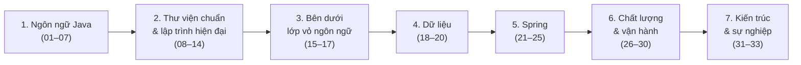

<div align="center">

# Java Backend Roadmap

### Ghi chú học Java, từ cú pháp cơ bản đến backend production-ready


[Lộ trình](#lộ-trình) · [Cấu trúc dự án](#cấu-trúc-dự-án) · [Bắt đầu](#bắt-đầu) · [Đóng góp](#đóng-góp) · [FAQ](#faq)

</div>

---

## Mục lục

- [Giới thiệu](#giới-thiệu)
- [Repo này dành cho ai](#repo-này-dành-cho-ai)
- [Lộ trình](#lộ-trình)
- [Cấu trúc dự án](#cấu-trúc-dự-án)
- [Bắt đầu](#bắt-đầu)
- [Cách một module được tổ chức](#cách-một-module-được-tổ-chức)
- [Phạm vi & giới hạn](#phạm-vi--giới-hạn)
- [Đóng góp](#đóng-góp)
- [FAQ](#faq)
- [Roadmap của repo](#roadmap-của-repo)
- [License](#license)
- [Tác giả](#tác-giả)

---

## Giới thiệu

Đây là tài liệu học Java tự biên soạn trong quá trình đi từ nền tảng ngôn ngữ đến backend thực chiến — không phải bản dịch hay tổng hợp lại khóa học có sẵn nào. Mỗi module là một file Markdown độc lập, đủ sâu để đọc lại về sau mà không phải tra thêm nguồn khác: có giải thích khái niệm, ví dụ code, bảng so sánh, các bẫy hay gặp, và bài tập tự kiểm tra ở cuối.

**Vấn đề mà repo này giải quyết:** phần lớn tài liệu học Java trên mạng hoặc quá cơ bản (chỉ dừng ở cú pháp) hoặc quá rời rạc (mỗi nơi một mảnh, không có mạch nối từ ngôn ngữ → framework → vận hành thực tế). Repo này gom lại thành một lộ trình liền mạch, đánh số thứ tự rõ ràng, để không phải tự ghép nối kiến thức từ nhiều nguồn.

## Repo này dành cho ai

- Người đã biết cú pháp Java cơ bản, muốn hệ thống hóa lại kiến thức theo lộ trình rõ ràng trước khi phỏng vấn hoặc đi làm.
- Người đang học Spring Boot nhưng cảm thấy hổng nền tảng OOP/Collections/Concurrency, cần quay lại củng cố.
- Bất kỳ ai muốn một bộ ghi chú tiếng Việt đủ sâu để dùng làm tài liệu ôn tập, không cần đọc lại sách giáo trình dày cả nghìn trang.

## Lộ trình



Đọc theo đúng thứ tự 01 → 33 nếu mới bắt đầu — các module sau thường giả định đã đọc module trước (module 20 JPA/Hibernate giả định đã đọc module 08 Collections và module 18 Database & SQL; module 24 Spring Data giả định đã đọc module 21 Spring Core). Nếu đã có nền tảng, cứ nhảy thẳng vào phần đang thiếu.

Cột **Trạng thái** để bạn tự đánh dấu tiến độ học — mặc định toàn bộ **☐ Chưa học**, tự sửa thành `[x]` (hoặc thay `☐` bằng `☑`) khi đọc xong module đó.

### Giai đoạn 1 — Ngôn ngữ Java

| # | Module | Trạng thái |
|---|---|---|
| 01 | [Cú pháp & kiểu dữ liệu](01-cu-phap-kieu-du-lieu/01-cu-phap-kieu-du-lieu.md) | ☐ Chưa học |
| 02 | [Cấu trúc điều khiển](02-cau-truc-dieu-khien/02-cau-truc-dieu-khien.md) | ☐ Chưa học |
| 03 | [Class, Object, Method](<03 class object method/03-class-object-method.md>) | ☐ Chưa học |
| 04 | [4 trụ cột OOP](<04 4 tru cot oop/04-4-tru-cot-oop.md>) | ☐ Chưa học |
| 05 | [Interface vs Abstract Class](<05 interface vs abstract class fix/05-interface-vs-abstract-class.md>) | ☐ Chưa học |
| 06 | [SOLID Principles](<06 solid principles/06-solid-principles.md>) | ☐ Chưa học |
| 07 | [equals / hashCode / toString](<07 equals hashcode tostring/07-equals-hashcode-tostring.md>) | ☐ Chưa học |

### Giai đoạn 2 — Thư viện chuẩn & lập trình hiện đại

| # | Module | Trạng thái |
|---|---|---|
| 08 | [Collections Framework](<08 collections framework/08-collections-framework.md>) | ☐ Chưa học |
| 09 | [Generics](<09 generics/09-generics.md>) | ☐ Chưa học |
| 10 | [Stream API & Lambda](<10 stream api lambda/10-stream-api-lambda.md>) | ☐ Chưa học |
| 11 | [Exception Handling, I/O & Networking](<11 exception handling io/11-exception-handling-io.md>) | ☐ Chưa học |
| 12 | [Thread cơ bản](<12 thread co ban/12-thread-co-ban.md>) | ☐ Chưa học |
| 13 | [Concurrency Utilities](<13 concurrency utilities/13-concurrency-utilities.md>) | ☐ Chưa học |
| 14 | [Java hiện đại (9 → 21)](<14 java modern/14-java-modern.md>) | ☐ Chưa học |

### Giai đoạn 3 — Bên dưới lớp vỏ ngôn ngữ

| # | Module | Trạng thái |
|---|---|---|
| 15 | [JVM Internals](<15 jvm internals/15-jvm-internals.md>) | ☐ Chưa học |
| 16 | [Design Patterns](<16 design patterns/16-design-patterns.md>) | ☐ Chưa học |
| 17 | [Build Tools & quản lý dự án](<17 build tools quan ly du an/17-build-tools-quan-ly-du-an.md>) | ☐ Chưa học |

### Giai đoạn 4 — Dữ liệu

| # | Module | Trạng thái |
|---|---|---|
| 18 | [Database & SQL](<18 database sql/18-database-sql.md>) | ☐ Chưa học |
| 19 | [RDBMS vs NoSQL](<19 rdbms nosql/19-rdbms-nosql.md>) | ☐ Chưa học |
| 20 | [JPA / Hibernate](<20 jpa hibernate/20-jpa-hibernate.md>) | ☐ Chưa học |

### Giai đoạn 5 — Spring

| # | Module | Trạng thái |
|---|---|---|
| 21 | [Spring Core (IoC, DI, AOP)](<21 spring core/21-spring-core.md>) | ☐ Chưa học |
| 22 | [Spring Boot](<22 spring boot/22-spring-boot.md>) | ☐ Chưa học |
| 23 | [RESTful API Design](<23 restful api design/23-restful-api-design.md>) | ☐ Chưa học |
| 24 | [Spring Data & Persistence](<24 spring data persistence/24-spring-data-persistence.md>) | ☐ Chưa học |
| 25 | [Spring Security](<25 spring security/25-spring-security.md>) | ☐ Chưa học |

### Giai đoạn 6 — Chất lượng & vận hành

| # | Module | Trạng thái |
|---|---|---|
| 26 | [Testing](<26 testing/26-testing.md>) | ☐ Chưa học |
| 27 | [Caching & Messaging](<27 caching messaging/27-caching-messaging.md>) | ☐ Chưa học |
| 28 | [Microservices](<28 microservices/28-microservices.md>) | ☐ Chưa học |
| 29 | [DevOps cơ bản](<29 devops co ban/29-devops-co-ban.md>) | ☐ Chưa học |
| 30 | [Observability](<30 observability/30-observability.md>) | ☐ Chưa học |

### Giai đoạn 7 — Kiến trúc & sự nghiệp

| # | Module | Trạng thái |
|---|---|---|
| 31 | [System Design](<31 system design/31-system-design.md>) | ☐ Chưa học |
| 32 | [Bảo mật — OWASP Top 10](<32 bao mat owasp/32-bao-mat-owasp.md>) | ☐ Chưa học |
| 33 | [Soft Skills & Career](<33 soft skills career/33-soft-skills-career.md>) | ☐ Chưa học |

Ngoài 33 module lý thuyết, repo còn có [🕸️ Knowledge Graph](knowledge-graph.md) thể hiện trực quan các module liên hệ chéo với nhau.

## Cấu trúc dự án

```text
java-core/
├── 01-cu-phap-kieu-du-lieu/
│   ├── 01-cu-phap-kieu-du-lieu.md   # lý thuyết + bài tập của module
│   └── src/                         # code Java minh họa / bài làm
├── 02-cau-truc-dieu-khien/
│   ├── 02-cau-truc-dieu-khien.md
│   └── src/
├── ...                               # 03 → 33, cùng một khuôn mẫu
├── 33 soft skills career/
│   └── 33-soft-skills-career.md
├── dap-an-day-du/                     # lời giải chi tiết bài tập module 03 → 33
├── docs-site/mkdocs.yml               # cấu hình website tài liệu (MkDocs Material)
├── knowledge-graph.md                 # trang sơ đồ quan hệ giữa các module
├── .github/workflows/                 # CI kiểm tra chất lượng docs + build/deploy site
└── README.MD
```

Mỗi module là một thư mục độc lập — xóa hoặc di chuyển một module không ảnh hưởng module khác. Không có file cấu hình build dùng chung ở gốc repo cho phần code Java minh họa (xem [Phạm vi & giới hạn](#phạm-vi--giới-hạn)).

## Bắt đầu

### Yêu cầu

- JDK 21 trở lên (một số module dùng tính năng Java 21 như Virtual Thread, Record Pattern).

```bash
java --version
```

### Đọc tài liệu

Không cần cài đặt gì để đọc — mở trực tiếp file `.md` của module trên GitHub, trong editor bất kỳ, hoặc qua trang web MkDocs (nếu đã bật GitHub Pages cho repo, xem `mkdocs.yml`).

### Chạy thử code minh họa

Mỗi thư mục `src/` là một IntelliJ module độc lập (không dùng Maven/Gradle), biên dịch trực tiếp bằng `javac`:

```bash
cd "05 interface vs abstract class fix/src"
javac Main.java
java Main
```

Nếu dùng IntelliJ IDEA, mở thẳng thư mục gốc `java-core/` — IntelliJ sẽ nhận diện từng `*.iml` như một module riêng.

## Cách một module được tổ chức

Mỗi file `.md` module theo cùng một khuôn:

1. Mục lục nội bộ.
2. Từng khái niệm: giải thích + ví dụ code + bảng so sánh khi cần.
3. Mục `⚠️ Bẫy thường gặp` — lỗi/hiểu nhầm phổ biến.
4. Bảng tổng kết ghi nhớ nhanh cuối bài.
5. Bài tập luyện tập (trắc nghiệm nhận định, viết code, nâng cao) ở cuối mỗi module — đáp án chi tiết cho module 03 → 33 nằm trong `dap-an-day-du/`, module 01–02 có đáp án ngay trong `src/` của module.

## Phạm vi & giới hạn

Repo này là **tài liệu học**, không phải một ứng dụng chạy được — nên sẽ không tìm thấy các phần thường có ở README của một dự án phần mềm: không có API để gọi, không có database để kết nối, không có Dockerfile để build, không có pipeline deploy ứng dụng. Phần "code minh họa" trong mỗi `src/` chỉ để chạy thử khái niệm trong module đó, không phải một hệ thống liên kết với nhau. CI trong repo (`.github/workflows/`) kiểm tra **chất lượng tài liệu** (Markdown, sơ đồ Mermaid, liên kết chéo) và **build/deploy trang MkDocs** — không phải CI cho một ứng dụng backend.

## Đóng góp

Repo hiện là ghi chú cá nhân, nhưng nếu bạn phát hiện sai sót kỹ thuật hoặc muốn góp ý:

1. Tạo Issue mô tả rõ module nào, phần nào, và vì sao cho là chưa đúng.
2. Hoặc mở Pull Request theo quy trình: fork → tạo nhánh → sửa → mở PR kèm mô tả ngắn gọn thay đổi.

```text
docs/<mô-tả-ngắn>     # cập nhật nội dung một module
fix/<mô-tả-ngắn>      # sửa lỗi kỹ thuật/chính tả
```

Không có convention commit bắt buộc, nhưng ưu tiên message mô tả rõ *module nào* thay đổi, ví dụ: `docs(module-20): sửa ví dụ N+1 query`. Trước khi mở PR, CI (`docs-ci.yml`) sẽ tự kiểm tra Markdown lint, sơ đồ Mermaid, liên kết chéo và cấu trúc file — xem log Actions nếu PR bị fail.

## FAQ

**Vì sao không có `pom.xml` hay `build.gradle` ở gốc repo?**
Vì đây không phải một dự án Java thống nhất — mỗi module là bài học độc lập, code minh họa chỉ vài file nên không cần build tool riêng. Kiến thức về Maven/Gradle được dạy ở [module 17](<17 build tools quan ly du an/17-build-tools-quan-ly-du-an.md>).

**Nội dung có đảm bảo chính xác 100% không?**
Đây là tài liệu tự học, đã cố gắng kiểm chứng kỹ nhưng vẫn có thể còn sai sót hoặc góc nhìn cá nhân ở một số đoạn — nếu thấy chỗ nào chưa đúng, xem mục [Đóng góp](#đóng-góp).

**Vì sao thư mục có khoảng trắng trong tên (`08 collections framework`) thay vì gạch nối?**
Không nhất quán — phần đầu repo (module 01–02) đặt tên theo kiểu `kebab-case`, các module sau đặt trực tiếp bằng tên IntelliJ module. Giữ nguyên để không phá liên kết cũ, không ảnh hưởng tới việc đọc nội dung.

**Trang MkDocs lấy nội dung từ đâu, có phải maintain hai bản không?**
Không — `mkdocs.yml` trỏ thẳng vào các file `.md` hiện có (`docs_dir: .`), không copy nội dung sang thư mục riêng. Sửa file module như bình thường, trang web tự cập nhật theo.

**Có bản tiếng Anh không?**
Chưa — toàn bộ nội dung hiện là tiếng Việt.

## Roadmap của repo

- [x] Hoàn thành lý thuyết chi tiết cho 33 module (01 → 33).
- [x] Bài tập tự luyện + đáp án cho từng module.
- [x] README đồng bộ với cấu trúc 33 module thực tế + trạng thái học.
- [x] Website MkDocs Material + GitHub Pages, CI kiểm tra chất lượng tài liệu, trang Knowledge Graph.
- [ ] Đề xuất: `examples/`/`exercises/` runnable code + Maven multi-module + JUnit cho từng module.
- [ ] Đề xuất: Capstone Spring Boot (hệ thống đặt hàng — PostgreSQL, Redis, JWT, Kafka/RabbitMQ, Docker, metrics) liên kết ngược về từng module lý thuyết.
- [ ] Đề xuất: bản tiếng Anh song song.

Các mục đánh dấu "Đề xuất" là ý tưởng, chưa có cam kết thời gian thực hiện.

## License

Chưa áp dụng giấy phép mã nguồn mở nào cho repo này.

## Tác giả

**Ɠia Pɦo Huỳnh** — [@giaph4](https://github.com/giaph4)

---

<div align="center">

Nếu tài liệu này hữu ích, để lại ⭐ cho repo.

</div>
